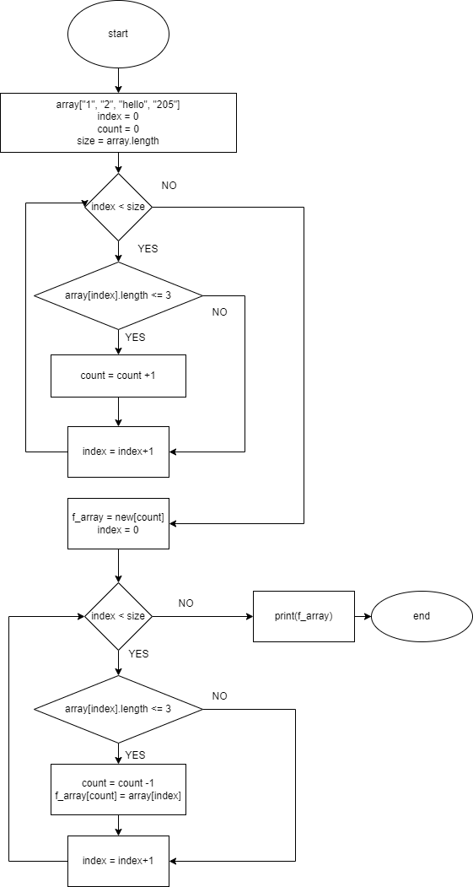

# final_work
контрольная работа ГБ

**СОЗДАНИЕ БЛОК-СХЕМЫ**

**Решение задачи**

Т.к. было рекомендовано использовать только массивы, задача была разбита на две стадии:
1. На первой стадии находилась длина результирующего массива;
2. На второй был создан и заполнен нужными данными массив этой длины.
